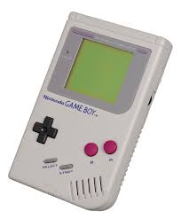

# GameBoy 🎮

A lightweight C++ collection of classic games, built with simplicity, logic, and fun in mind. This project was developed as part of my programming journey during my Data Science degree at FAST University.

  

## 🕹️ Games Included
- **Snake** – Navigate the growing snake and avoid hitting walls or yourself.
- **Wordle** – Guess the 5-letter word within 6 tries, with colour-coded feedback.
- **Hangman** – Classic letter-guessing game with a text-based gallows.

## 🛠️ Built With
- **Language:** C++  
- **Paradigm:** Object-Oriented Programming (OOP)  
- **Interface:** Graphic User Interface (GUI)  
- **Platform:** Windows

## 📦 Features
- Simple, readable code – great for beginner developers or students.
- Score tracking and logic separation for each game.
- Interactive GUI with real-time feedback and basic animations.
- Fully modular design for easy extension or refactoring.

## 📚 Learning Goals
This project helped me practise:
- OOP principles (classes, inheritance, encapsulation)
- Game logic and flow control
- Input handling in C++
- Designing user feedback in terminal-based UIs

### Clone the repository:
   git clone https://github.com/ib-hussain/GameBoy.git
   
Note: Each game may be compiled separately depending on your folder structure.

## 📈 Future Plans
Add scoreboards and levels
Save/load progress features

📫 Contact
If you’d like to collaborate, discuss improvements, or just say hi:

📧 ibrahimbeaconarion@gmail.com

Thanks for visiting! If you found this helpful or fun, please ⭐ the repository.

Let me know if you'd like this updated with images, GIF demos.
