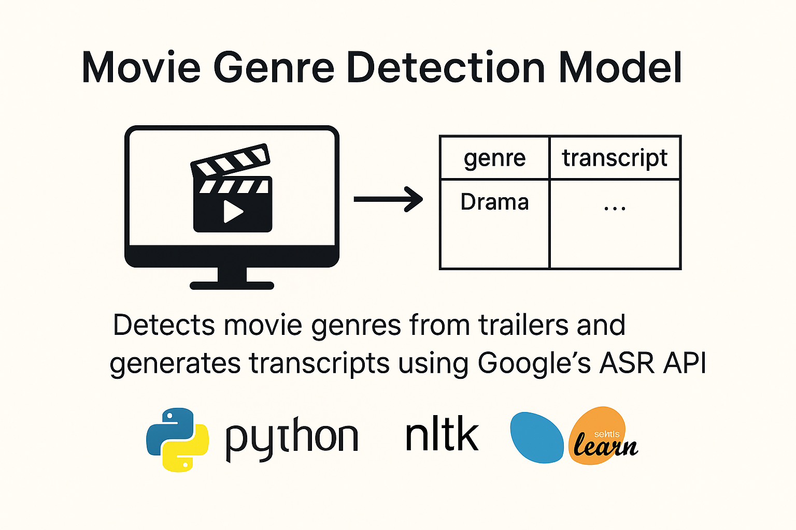

<h1 align="center">Movie Genre Detection Model</h1>

This project aims to detect the <strong>genre(s)</strong> of a movie by analysing its <strong>YouTube trailer</strong>, using <strong>transcript-based machine learning involing NLP</strong> techniques. Each trailer may belong to <strong>multiple genres</strong>, making this a <em>multi-label classification task</em>.

  

<h2>📁 Dataset & Preprocessing</h2>

I used the <a href="https://grouplens.org/datasets/movielens/" target="_blank">MovieLens Dataset</a> to map <code>movieId</code> to YouTube trailer IDs. The dataset preparation involves:

<ul>
  <li>Selection of <strong>~600 trailers</strong> (subset of greater than 25,000 movie IDs)</li>
  <li>Downloading trailers using <a href="https://github.com/yt-dlp/yt-dlp" target="_blank"> yt-dlp</a></li>
  <li><strong>Audio/video separation</strong> and <strong>preprocessing</strong></li>
  <li><strong>Speech-to-text transcription</strong> using Google's ASR model</li>
  <li>Cleaning the text: punctuation removal, tokenisation, lemmatisation</li>
  <li>Final CSV output:</li>
</ul>

<pre>
<code>
file_name, movie_name, genre, transcript, audio_file
</code>
</pre>

<h2>Genre Classification</h2>

We have focused on the following <strong>7 primary genres</strong>:

<ul>
  <li>Action</li>
  <li>Comedy</li>
  <li>Drama</li>
  <li>Romance</li>
  <li>Horror</li>
  <li>Thriller</li>
  <li>Sci-Fi</li>
</ul>

Each trailer may belong to one or more of these genres.

(Other genres are included as well, but the  focus is particularly on these genres) 

<h2>Modelling Pipeline</h2>

<h3>🔹 1. Feature Engineering</h3>
<ul>
  <li><strong>N-gram extraction</strong> (up to n=10)</li>
  <li>Genre-wise frequency distribution</li>
  <li>Filtering of overlapping/common words</li>
</ul>

<h3>🔹 2. Supervised Learning</h3>
<ul>
  <li>Model: Logistic Regression or similar</li>
  <li>Input: Tokenised transcripts</li>
  <li>Output: Multi-label genre predictions</li>
</ul>

<h3>🔹 3. Unsupervised Extension</h3>
<ul>
  <li>Use clustering on the full MovieLens dataset (25k+ trailers)</li>
  <li>Identify emergent genre clusters via transcript similarity</li>
</ul>

<h2>Data Splits</h2>
<ul>
  <li><strong>Training:</strong> 70%</li>
  <li><strong>Testing:</strong> 30%</li>
  <li>Stratified to ensure balanced genre representation</li>
</ul>

<h2>📊 Evaluation Metrics</h2>
<ul>
  <li>Accuracy@k (Top-k prediction accuracy)</li>
  <li>Micro / Macro F1-score</li>
  <li>Mean Average Precision (mAP)</li>
</ul>

<h2>🛠 Tools & Libraries</h2>
<ul>
  <li>Python, <code>scikit-learn</code>, <code>yt-dlp</code></li>
  <li>NLP: <code>NLTK</code>, <code>spaCy</code> or similar</li>
  <li>Transcription: Google Speech Recognition API</li>
</ul>

## 👨‍💻 Contributors

- [@ib-hussain](https://github.com/ib-hussain)
- [@AmnaTariqRana](https://github.com/AmnaTariqRana)

---
<h2>📚 References</h2>
<ol>
  <li>Radford et al. (2022), <em>Robust Speech Recognition via Large‑Scale Weak Supervision</em>, Whisper ASR</li>
  <li>Harper & Konstan (2015), <em>The MovieLens Datasets: History and Context</em>, ACM TiiS</li>
  <li>Sulun et al. (2024), <em>Movie Trailer Genre Classification Using Multimodal Pretrained Features</em>, ESWA</li>
  <li>nfu Liu et al. (2021), <em>Multi-label Text Classification with tALBERT-CNN</em>, IJCI</li>
</ol>

