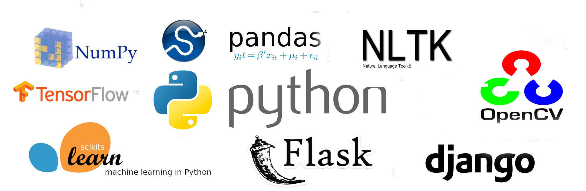

<h1 align="center">Python Projects</h1>

This repository contains a collection of Python-based projects focusing on **data cleaning**, **statistical analysis**, **basic machine learning**, **Natural Language Processing (NLP)**, and **Computer Vision (CV)**. These projects reflect my applied learning during my Data Science degree at FAST University, Islamabad.

  

## Projects Overview

### 🔹 Data Cleaning & Preprocessing
- Cleaned and transformed medium- to large-scale datasets using `pandas` and `NumPy`.
- Addressed real-world inconsistencies including missing values, irregular formatting, and encoding issues.
- Prepared datasets for downstream machine learning and statistical analysis.

### 🔹 Natural Language Processing (NLP)
- Applied NLP techniques including:
  - Tokenisation, stemming, lemmatisation  
  - Sentiment analysis  
  - Stopword removal for multilingual datasets, including **Urdu**  
- Addressed challenges in Urdu text processing, such as script inconsistencies and non-standard grammar.

### 🔹 Statistical Analysis
- Used Python libraries like `scipy`, `statsmodels`, `statistics`, `seaborn`, `sklearn` and `plotly` to implement:
  - Hypothesis testing  
  - Regression models  
  - Probabilistic Inflation Prediction

### 🔹 Introductory Machine Learning
- Built basic models for classification and clustering using `scikit-learn`.
- Evaluated model accuracy and performance using appropriate metrics.
- Explored feature engineering and selection techniques.

### 🔹 Image Processing (OpenCV)
- Conducted beginner-level experiments with `OpenCV`, including:
  - Image loading, manipulation, thresholding  
  - Basic filtering and contour detection

## Tech Stack
- **Languages:** Python, R  
- **Libraries:** pandas, NumPy, matplotlib, scikit-learn, NLTK, OpenCV, scipy  
- **Tools:** Jupyter Notebook, Git, VS Code

## Learning Outcomes
These projects helped reinforce:
- Practical data science workflows  
- Text and image data handling  
- Statistical analysis and ML implementation in Python  
- Clear and modular code structuring

<h3>📁 Repository Structure</h3>
<ul>
  <li>
    <strong>Data Cleaning</strong>  Scripts and notebooks for cleaning and preprocessing raw datasets. 
  </li>
  <li>
    <strong>NLP</strong>  Tasks focused on text processing and sentiment analysis and text classificiation.
  </li>
  <li>
    <strong>Statistical Analysis</strong>  Implementation of statistical tests, regression models, and exploratory data analysis (EDA).
  </li>
  <li>
    <strong>Basis Ml Models</strong>  Introductory machine learning models and evaluation workflows.
  </li>
  <li>
    <strong>Computer Vision</strong>  Beginner-level image processing experiments using OpenCV.
  </li>
</ul>
